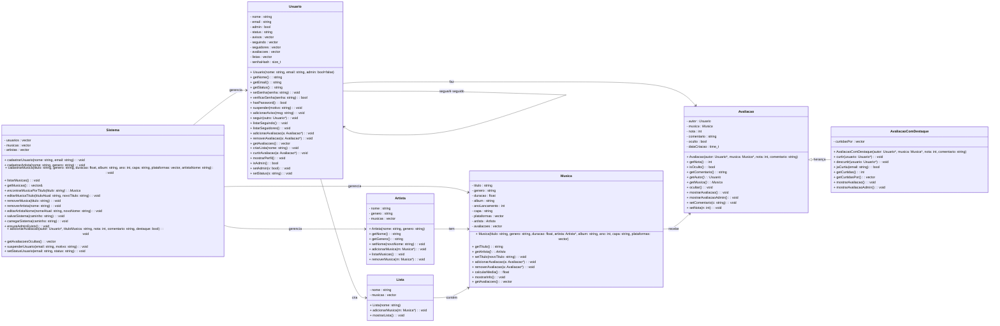

```mermaid
classDiagram
direction LR

class Sistema {
    - usuarios : vector<Usuario*>
    - musicas : vector<Musica*>
    - artistas : vector<Artista*>
    + cadastrarUsuario(nome: string, email: string) : void
    + cadastrarArtista(nome: string, genero: string) : void
    + cadastrarMusica(titulo: string, genero: string, duracao: float, album: string, ano: int, capa: string, plataformas: vector<string>, artistaNome: string) : void
    + listarMusicas() : void
    + getMusicas() : vector<Musica*>&
    + encontrarMusicaPorTitulo(titulo: string) : Musica*
    + editarMusicaTitulo(tituloAtual: string, novoTitulo: string) : void
    + removerMusica(titulo: string) : void
    + removerArtista(nome: string) : void
    + editarArtistaNome(nomeAtual: string, novoNome: string) : void
    + salvarSistema(caminho: string) : void
    + carregarSistema(caminho: string) : void
    + ensureAdminExists() : void
    + adicionarAvaliacao(autor: Usuario*, tituloMusica: string, nota: int, comentario: string, destaque: bool) : void
    + getAvaliacoesOcultas() : vector<Avaliacao*>
    + suspenderUsuario(email: string, motivo: string) : void
    + setStatusUsuario(email: string, status: string) : void
}

class Usuario {
    - nome : string
    - email : string
    - admin : bool
    - status : string
    - avisos : vector<string>
    - seguindo : vector<Usuario*>
    - seguidores : vector<Usuario*>
    - avaliacoes : vector<Avaliacao*>
    - listas : vector<Lista*>
    - senhaHash : size_t
    + Usuario(nome: string, email: string, admin: bool=false)
    + getNome() : string
    + getEmail() : string
    + getStatus() : string
    + setSenha(senha: string) : void
    + verificarSenha(senha: string) : bool
    + hasPassword() : bool
    + suspender(motivo: string) : void
    + adicionarAviso(msg: string) : void
    + seguir(outro: Usuario*) : void
    + listarSeguindo() : void
    + listarSeguidores() : void
    + adicionarAvaliacao(a: Avaliacao*) : void
    + removerAvaliacao(a: Avaliacao*) : void
    + getAvaliacoes() : vector<Avaliacao*>
    + criarLista(nome: string) : void
    + curtirAvaliacao(a: Avaliacao*) : void
    + mostrarPerfil() : void
    + isAdmin() : bool
    + setAdmin(v: bool) : void
    + setStatus(s: string) : void
}

class Lista {
    - nome : string
    - musicas : vector<Musica*>
    + Lista(nome: string)
    + adicionarMusica(m: Musica*) : void
    + mostrarLista() : void
}

class Artista {
    - nome : string
    - genero : string
    - musicas : vector<Musica*>
    + Artista(nome: string, genero: string)
    + getNome() : string
    + getGenero() : string
    + setNome(novoNome: string) : void
    + adicionarMusica(m: Musica*) : void
    + listarMusicas() : void
    + removerMusica(m: Musica*) : void
}

class Musica {
    - titulo : string
    - genero : string
    - duracao : float
    - album : string
    - anoLancamento : int
    - capa : string
    - plataformas : vector<string>
    - artista : Artista*
    - avaliacoes : vector<Avaliacao*>
    + Musica(titulo: string, genero: string, duracao: float, artista: Artista*, album: string, ano: int, capa: string, plataformas: vector<string>)
    + getTitulo() : string
    + getArtista() : Artista*
    + setTitulo(novoTitulo: string) : void
    + adicionarAvaliacao(a: Avaliacao*) : void
    + removerAvaliacao(a: Avaliacao*) : void
    + calcularMedia() : float
    + mostrarInfo() : void
    + getAvaliacoes() : vector<Avaliacao*>
}

class Avaliacao {
    - autor : Usuario*
    - musica : Musica*
    - nota : int
    - comentario : string
    - oculto : bool
    - dataCriacao : time_t
    + Avaliacao(autor: Usuario*, musica: Musica*, nota: int, comentario: string)
    + getNota() : int
    + isOculto() : bool
    + getComentario() : string
    + getAutor() : Usuario*
    + getMusica() : Musica*
    + ocultar() : void
    + mostrarAvaliacao() : void
    + mostrarAvaliacaoAdmin() : void
    + setComentario(c: string) : void
    + setNota(n: int) : void
}

class AvaliacaoComDestaque {
    - curtidasPor : vector<string>
    + AvaliacaoComDestaque(autor: Usuario*, musica: Musica*, nota: int, comentario: string)
    + curtir(usuario: Usuario*) : void
    + descurtir(usuario: Usuario*) : void
    + jaCurtiu(email: string) : bool
    + getCurtidas() : int
    + getCurtidasPor() : vector<string>
    + mostrarAvaliacao() : void
    + mostrarAvaliacaoAdmin() : void
}

%% Relações e heranças

Sistema --> Usuario : gerencia
Sistema --> Musica : gerencia
Sistema --> Artista : gerencia

Usuario --> Lista : cria
Usuario --> Avaliacao : faz
Usuario --> Usuario : segue/é seguido
Artista --> Musica : tem
Musica --> Avaliacao : recebe
Avaliacao <|-- AvaliacaoComDestaque : herança

Lista --> Musica : contém


```
